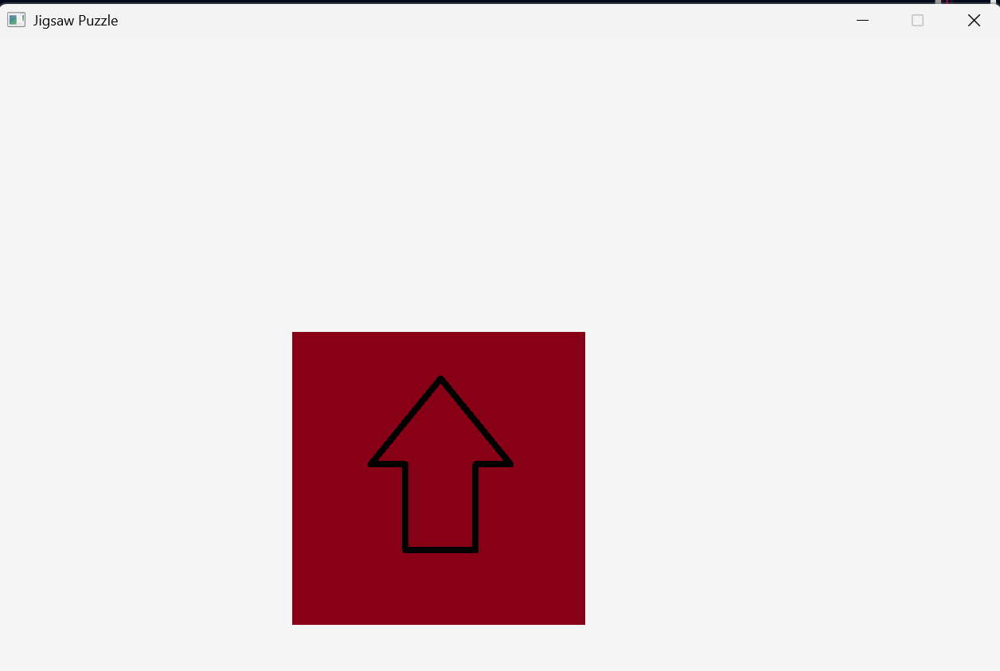

# 🧩 Jigsaw Puzzle Prototype (C++ / Raylib)

This is a small work-in-progress puzzle game built in C++ using the [Raylib](https://www.raylib.com/) graphics library.

The goal of the project is to experiment with:
- slicing images into tiles (jigsaw pieces),
- managing textures and memory,
- setting up a functional render loop in C++,
- learning how to interact with user input.

> ⚠️ **This project is in early development** and not yet fully playable. It is part of my journey to learn graphics programming and real-time systems.

---

## 🎮 Features (Current)

✅ Opens a game window using Raylib  
✅ Loads and slices an image into 4×4 puzzle tiles  
✅ Displays all tiles on screen in a grid  
✅ Mouse and logic system scaffolded  
✅ Uses C++ structs, image and texture memory management

---

## 🔜 Planned / TODO

- Add drag-and-drop logic for moving puzzle pieces  
- Implement snapping to correct positions  
- Shuffle pieces randomly at start  
- Add win condition and game over screen  
- Add UI (restart button, help overlay)  
- Clean up structure and memory management

---

## 🧠 What I’ve Learned So Far

- Using Raylib to handle window creation, input, textures  
- How to divide an image into grid-based segments  
- Basics of rendering a loop and refreshing the screen in 60 FPS  
- Structuring logic for game pieces using `struct` and arrays

---

## 🚀 How to Build & Run

### Prerequisites:
- C++17 compiler (e.g. `g++`, `clang++`, MSVC)
- Raylib is installed and configured
  - [Raylib install guide (official)](https://github.com/raysan5/raylib/wiki)

### Example build (Linux/macOS):
```bash
g++ main.cpp -o jigsaw -lraylib -lGL -lm -lpthread -ldl -lrt -lX11
./jigsaw
```
🖼 Screenshot (current state):
This early screenshot shows a single puzzle piece rendered using a sliced image segment. It represents the first working visual output of the game loop and drawing system: <br/>


🙋‍♀️ Author
Made by Květuše (Yushikuni) – exploring C++ graphics and gameplay systems.
